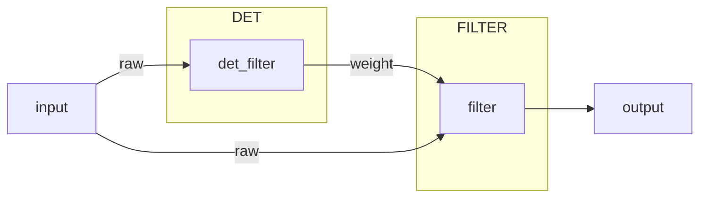
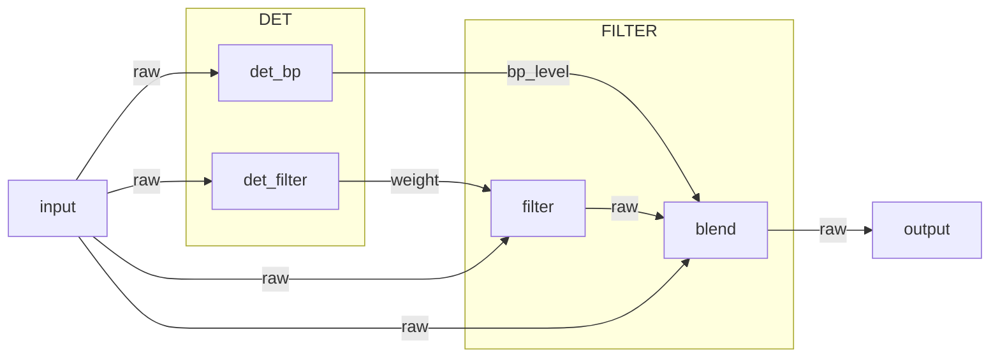

# bpc

## BPC
### without det_bp

```mermaid
graph LR;
    input -->|raw|det_filter
    det_filter -->|weight| filter
    input -->|raw| filter
    filter --> output
subgraph DET
    det_filter
end
subgraph FILTER
    filter
end
```
### with det_bp

```mermaid
graph LR;
    input -->|raw|det_bp
    input -->|raw|det_filter
    det_bp -->|bp_level| blend
    det_filter -->|weight| filter
    input -->|raw| filter
    input -->|raw| blend
    blend -->|raw|output
subgraph DET
    det_bp
    det_filter
end
subgraph FILTER
    filter -->|raw| blend
end
```
